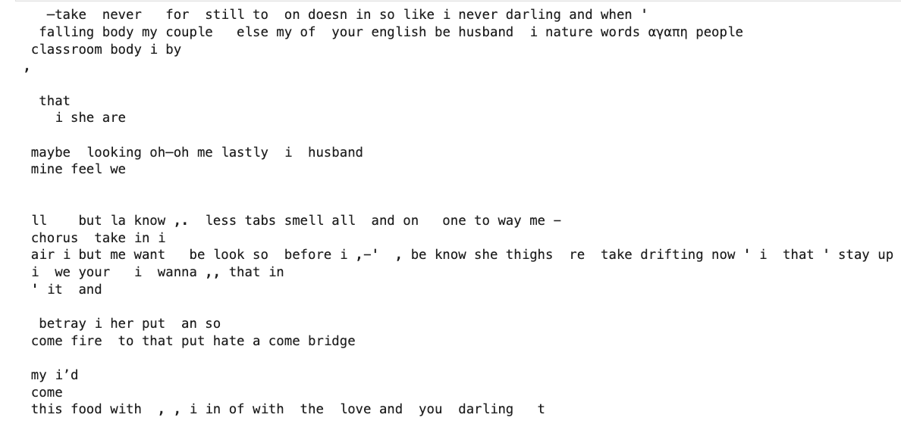
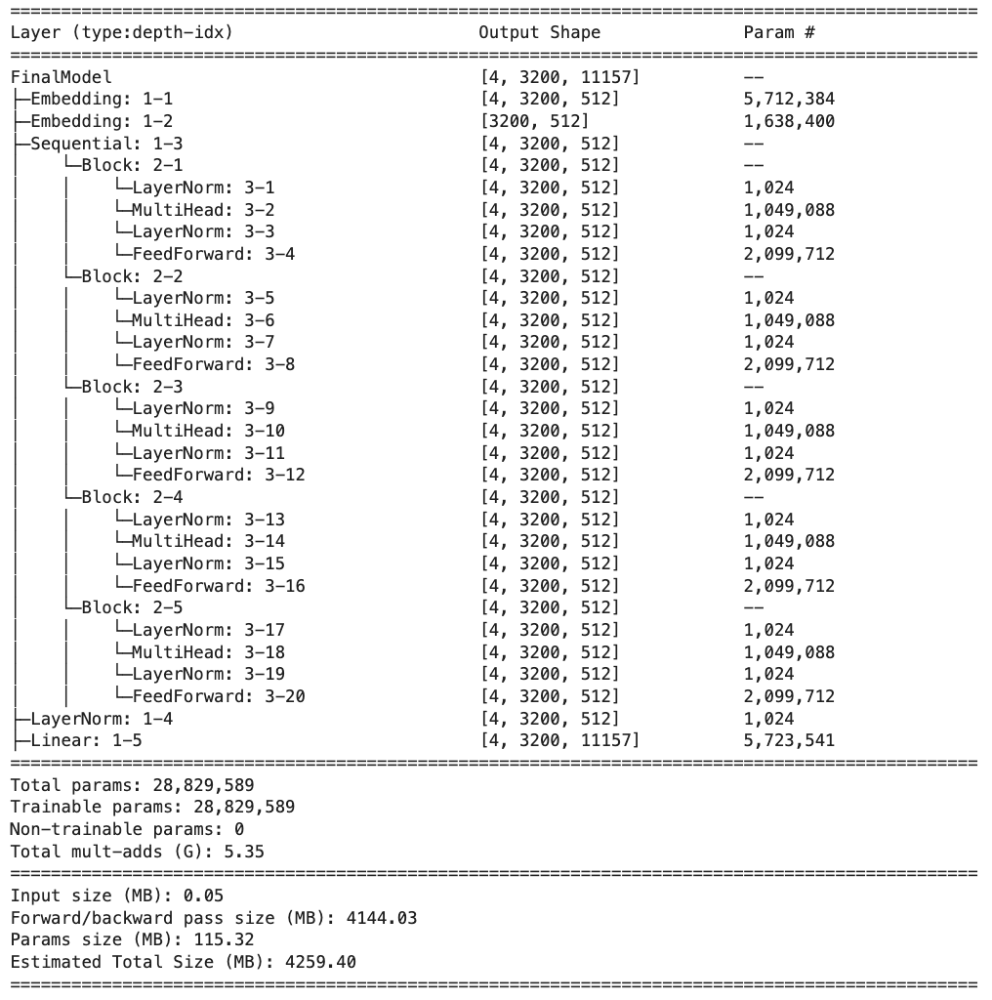
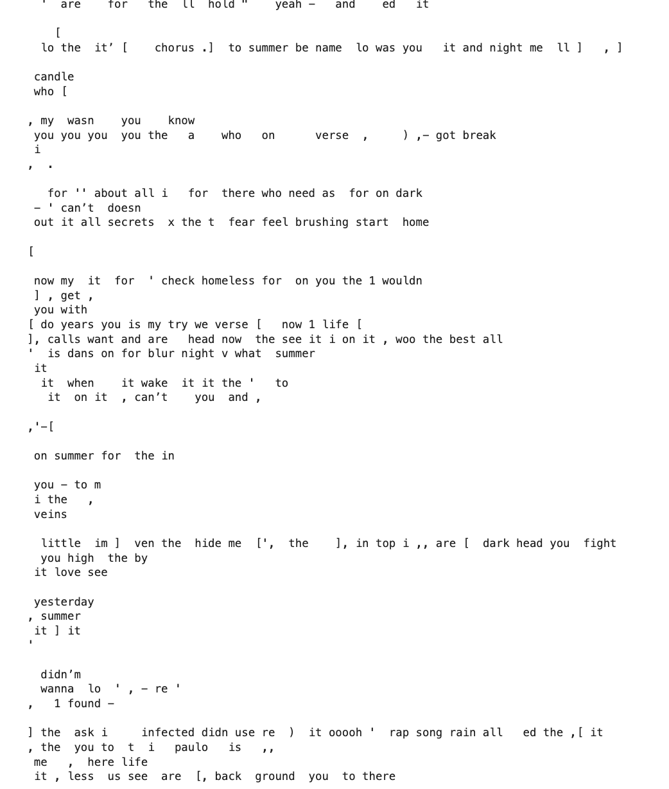

# transfomer-decoder-lyrics-generator
This is a small transformer model to generate lyrics. It is a word-level transformer-decoder based architecture.

The goal is to generate a similar lyrics by artist using transformer's decoder model.

## Demo
Here is the demo of the lyrics generated.

<p align="center">
  <video width="600" autoplay loop muted playsinline>
    <source src="assets/transformers.mp4" type="video/mp4">
    Your browser does not support the video tag.
  </video>
</p>

## Dataset
The dataset and the tokens are placed inside the data folder. It is the collection of lyrics. 


## Result generated:
Output after 100 epoch. 

 <p align="center">
  
</p>

## Tokens:
Since it is a word level model. Tokens are the words used in the lyrics.  
```text
['<start>', 'about', 'aboutwakin', 'above',
 'clappin', 'clapping', 'clare', 'claim',
 'dollaz', 'dolphin', 'dolphins', 'dom', 'dome',
 'everythingwould', 'everytime', 'everywhere', 'evidence',
 ...., '<end>']
```

## Model architecture
 <p align="center">
  
</p>

## Appendix

Output after few epoch. 

 <p align="center">
  
</p>

